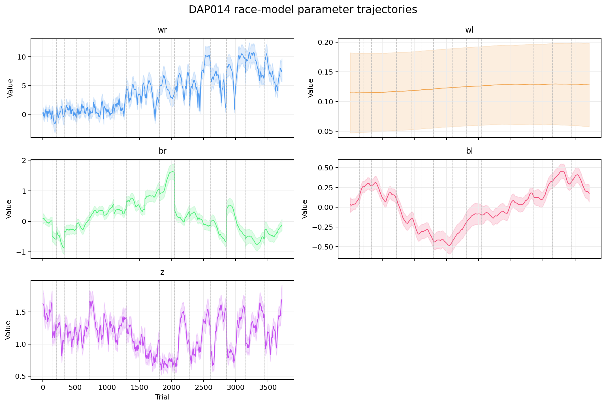
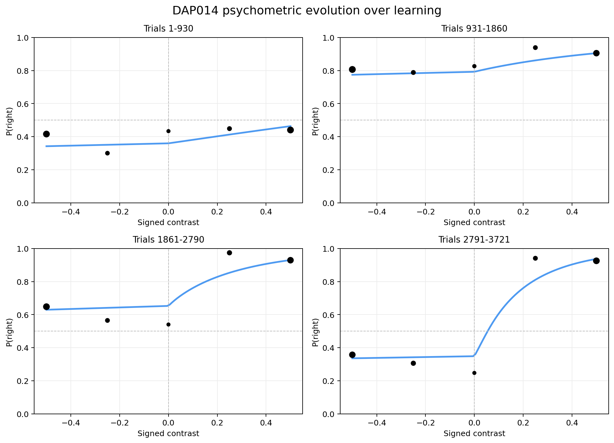

# psytrax

[](https://github.com/SamuelLiebana/psytrax/actions/workflows/docs.yml)

**Empirical Bayes fitting for trial-by-trial decision models**

psytrax fits a Gaussian random-walk prior over a sequence of K parameters across N trials and optimises the prior variance (hyperparameters) by maximising the marginal likelihood (evidence) using the Laplace approximation.

It is model-agnostic: you supply a **per-trial log-likelihood function** and psytrax handles all the inference machinery.

---

## See what it does

These example outputs come from the bundled DAP014 race-model fit in `example_fits/DAP014_race_fit.npy`.



<p align="center">
  
  
</p>

psytrax does not just return a best-fitting scalar. It recovers trial-by-trial parameter trajectories and turns them into learning-dependent psychometric and chronometric predictions like the ones above.

---

## Installation

For the web app or general use (installs all dependencies including Streamlit):

```bash
pip install -r requirements.txt
```

For Streamlit Community Cloud deployment, keep `requirements.txt` as the only
recognized Python dependency file in the repo root. Community Cloud prioritizes
`environment.yml` over `requirements.txt` and will ignore the latter if both are
present.

For development and tests only:

```bash
pip install -e .[dev]
```

## Documentation

The public documentation is published with GitHub Pages:

> **[https://samuelliebana.github.io/psytrax/](https://samuelliebana.github.io/psytrax/)**

The documentation is being built with Sphinx and organised around the Diataxis
framework: tutorials, user guide/how-to material, API reference, and community
pages. To build it locally:

```bash
pip install -e ".[docs]"
make -C docs html
```

Start with `docs/source/tutorials/first-fit.md` for a narrative walkthrough
written for an experimentalist fitting their first behavioural dataset.

---

## Quick start

```python
import psytrax
from psytrax.models.race import log_lik_trial, N_PARAMS, PARAM_NAMES, default_hyper, default_E0

data = {
    'inputs':          {'c': contrast_array},  # signed contrast, shape (N,)
    'responses':        response_array,        # 0 / 1, shape (N,)
    'times':            rt_array,              # reaction times, shape (N,)
    'session_lengths':  day_length_array,      # trials per session, shape (n_sessions,)
}

result = psytrax.fit(
    data               = data,
    log_lik_trial      = log_lik_trial,
    n_params           = N_PARAMS,
    param_names        = PARAM_NAMES,
    hyper              = default_hyper(),
    E0                 = default_E0(N),
    session_boundaries = True,
)

print(result['params'].shape)   # (K, N)
print(result['log_evidence'])   # scalar
```

If you want a single process-noise hyperparameter shared across all parameters,
pass `shared_sigma=True`:

```python
result = psytrax.fit(
    data=data,
    log_lik_trial=log_lik_trial,
    n_params=N_PARAMS,
    shared_sigma=True,
)
```

The built-in models expose the same option through `default_hyper(shared_sigma=True)`.

---

## Writing your own model

Provide any JAX-compatible per-trial function:

```python
import jax
import jax.numpy as jnp

def my_log_lik_trial(params, dat_trial, model_hyper):
    """
    params      : jnp array (K,)  — trial-varying parameters for this trial
    dat_trial   : dict — same keys as your data dict but scalar-valued per trial
                  (psytrax vmaps over trials automatically)
    model_hyper : dict — model-level scalar hyperparameters (constants across
                  trials), jointly optimised by Empirical Bayes alongside σ.
                  Pass an empty dict if your model doesn't need any.
    """
    w, b = params
    p = jax.nn.sigmoid(w * dat_trial['inputs']['x'] + b)
    return dat_trial['r'] * jnp.log(p) + (1 - dat_trial['r']) * jnp.log(1 - p)

result = psytrax.fit(data=data, log_lik_trial=my_log_lik_trial, n_params=2)
```

The function must be written with **`jax.numpy`** (not `numpy`) so that psytrax can differentiate through it to obtain the gradient and Hessian needed for MAP estimation and the Laplace approximation.

### Model-level hyperparameters

Some models have nuisance parameters that are *constant* across trials but
nonetheless need to be estimated from the data — for example, the race
model's within-trial accumulator noise `sig_i`. Expose them via
`default_model_hyper()` and read them from the third argument of
`log_lik_trial`:

```python
def default_model_hyper():
    return {'sig_i': 0.01}  # starting point for Empirical Bayes

def log_lik_trial(params, dat_trial, model_hyper):
    sig_i = model_hyper['sig_i']
    ...
```

`psytrax.fit` auto-detects `default_model_hyper()` from your model module and
optimises every entry jointly with `sigma`. Pass `optimise_model_hyper=False`
to keep them fixed.

You can also add a `DATA_SPEC` dict to your model to declare its data requirements. The web app uses this to drive interactive column mapping when users upload CSV data:

```python
DATA_SPEC = {
    'inputs': {
        'x': {'description': 'Stimulus feature', 'required': True},
    },
    'response': {
        'key': 'r',
        'description': 'Choice — discrete or continuous',
        'required': True,
    },
    'rt': {                                    # omit if the model does not use RT
        'key': 'T',
        'description': 'Reaction time (seconds)',
        'required': True,
    },
}
```

---

## Built-in models

| Model | File | K | RT? | Description |
|-------|------|---|-----|-------------|
| Logistic | `models/logistic.py` | 2 | No | Binary logistic regression |
| DDM (exact) | `models/ddm.py` | 4 | Yes | Drift diffusion model — Navarro & Fuss (2009) / Bogacz et al. (2006) series solution |
| DDM (approx) | `models/ddm_approx.py` | 3 | Yes | Drift diffusion model — inverse-Gaussian single-barrier approximation |
| Race | `models/race.py` | 5 + `sig_i` | Yes | Race model with separate accumulators (sig_i is a model_hyper estimated by EB) |
| MLP | `models/mlp.py` | 13 | No | 1→4→1 MLP with tanh hidden layer |

Each model exposes: `log_lik_trial`, `N_PARAMS`, `PARAM_NAMES`, `default_hyper()`, `default_E0(N)`, `default_learning_rule()`.
For a shared random-walk variance across parameters, call `default_hyper(shared_sigma=True)`.

See `examples/compare_models_DAP009.py` for a full comparison on real mouse data.

---

## Learning rules

By default, psytrax assumes a zero-mean Gaussian random walk for the parameter transitions: `w_{t+1} − w_t ~ N(0, diag(σ²))`. You can supply a **learning rule** to shift the transition mean, so the prior becomes:

```
w_{t+1} − w_t  ~  N( diag(α) · v̂_t,  diag(σ²) )
```

where `v̂_t = learning_rule(w_t, data_t)` is the raw update direction and `α` is a vector of per-parameter learning rates optimised alongside `σ` in the Empirical Bayes outer loop (following [Ashwood, Roy et al., NeurIPS 2020](https://proceedings.neurips.cc/paper/2020/hash/3a2f55e26e324b2c406d8b7df4607036-Abstract.html)).

### Using a built-in REINFORCE learning rule

Each built-in model provides a `default_learning_rule()` that implements the REINFORCE policy-gradient update: the score function `∇_θ log p(y_t | x_t, θ)` scaled by the reward signal. Your data must include a trial-aligned `reward` array under `data['inputs']['reward']`.

```python
from psytrax.models.logistic import (
    log_lik_trial, N_PARAMS, PARAM_NAMES, default_hyper, default_E0,
    default_learning_rule,
)

data = {
    'inputs': {
        'c': contrast_array,          # signed contrast, shape (N,)
        'reward': reward_array,        # 1 = rewarded, 0 = unrewarded, shape (N,)
    },
    'responses': response_array,
}

result = psytrax.fit(
    data           = data,
    log_lik_trial  = log_lik_trial,
    n_params       = N_PARAMS,
    param_names    = PARAM_NAMES,
    learning_rule  = default_learning_rule(),
)

print(result['hyper']['alpha'])   # optimised learning rates (K,)
```

### Writing your own learning rule

A learning rule is any JAX-traceable function with the signature:

```python
def my_learning_rule(params, dat_trial):
    """
    params    : jnp array (K,)  — parameters at trial t
    dat_trial : dict             — scalar-valued per-trial data (same format as log_lik_trial)
    Returns   : jnp array (K,)  — unnormalised update direction v̂_t
    """
    ...
    return update_direction
```

You can also use the factory functions in `psytrax.learning_rules`:

```python
from psytrax.learning_rules import make_reinforce, make_reinforce_baseline

# REINFORCE: v̂_t = ∇_θ log p(y|x,θ) · reward
lr = make_reinforce(my_log_lik_trial, reward_key='reward')

# REINFORCE with baseline: v̂_t = ∇_θ log p(y|x,θ) · (reward − baseline)
lr = make_reinforce_baseline(my_log_lik_trial, reward_key='reward', baseline_key='baseline')
```

---

## Data format

| Key | Alias | Type | Description |
|-----|-------|------|-------------|
| `inputs` | — | `dict` | Dict of input arrays, each `(N, ...)` |
| `responses` | `r` | `array (N,)` | Response variable — discrete (e.g. 0/1) or continuous |
| `times` | `T` | `array (N,)` | Reaction times *(optional)* |
| `session_lengths` | `dayLength` | `array` | Trials per session *(optional)* |

---

## Result dict

| Key | Shape | Description |
|-----|-------|-------------|
| `params` | `(K, N)` | MAP parameter estimates per trial |
| `param_names` | `list[str]` | Parameter names |
| `hyper` | `dict` | Optimised hyperparameters |
| `log_evidence` | `float` | Log marginal likelihood |
| `hess_info` | `dict` | `W_std`: posterior std `(K, N)` |
| `lr_hat` | `(K, N-1)` | Raw learning-rule outputs per trial *(only when `learning_rule` is set)* |
| `duration` | `timedelta` | Wall-clock fitting time |

---

## GPU support

psytrax requires float64 precision for stable Hessian computation and Laplace evidence. On Apple Silicon, psytrax uses a **hybrid** path when Metal is available: Metal float32 for MAP optimisation, then CPU float64 for Hessian / evidence. NVIDIA CUDA supports float64 directly and will accelerate fitting:

| Platform | Command |
|----------|---------|
| NVIDIA CUDA 12 | `pip install jax[cuda12]` |
| NVIDIA CUDA 11 | `pip install jax[cuda11_pip]` |

For most users, `device='auto'` is the recommended default.

---

## Performance

Wall-clock fitting times on Apple M4 CPU (JAX L-BFGS, float64), measured on the bundled dopamine example mice. Times include warm-start, MAP/EB cycles, joint choice + RT + dopamine likelihood, session-boundary process noise, and trajectory credible bands (`hess_calc='weights'`).

| Mouse | Trials | Time |
|---|---:|---:|
| DAP044 | 407 | 0.72 min (43s) |
| DAP048 | 2,580 | 1.33 min (80s) |
| DAP110 | 2,583 | 1.03 min (62s) |
| DAP039 | 3,162 | 2.65 min (159s) |
| DAP014 | 3,213 | 1.32 min (79s) |
| DAP027 | 3,693 | 1.75 min (105s) |
| DAP033 | 4,019 | 2.92 min (175s) |
| DAP013 | 4,413 | 1.78 min (107s) |
| DAP009 | 4,885 | 2.02 min (121s) |
| DAP023 | 4,911 | 1.63 min (98s) |
| DAP017 | 5,078 | 2.35 min (141s) |
| DAP011 | 5,413 | 2.69 min (162s) |
| DAP015 | 5,989 | 3.38 min (203s) |
| DAP051 | 6,170 | 1.97 min (118s) |
| DAP156 | 6,371 | 2.60 min (156s) |
| DAP022 | 6,548 | 3.77 min (226s) |
| DAP046 | 7,796 | 4.36 min (261s) |
| DAP050 | 8,173 | 3.56 min (214s) |
| DAP028 | 8,408 | 2.99 min (180s) |
| DAP024 | 9,602 | 1.87 min (112s) |
| DAP007 | 12,018 | 2.46 min (147s) |

Across all 21 bundled dopamine example mice, the median fit time was 2.35 min and the range was 0.72-4.36 min. These timings are intentionally based on real datasets rather than synthetic sweeps, so they are not perfectly monotonic in trial count. Fit time depends not just on `N`, but also on how many hyperparameter cycles the data trigger before the log-evidence stops improving.

NVIDIA CUDA (float64) is expected to give a further **3–8× speedup** for models with K ≥ 3, since the per-trial likelihood and the entire MAP loop run on-device via `jax.vmap`.

---

## Model recovery

`psytrax.simulate` and `psytrax.recover` let you sanity-check a model by
generating synthetic trial-by-trial data with known parameter trajectories,
fitting the model to that data, and comparing recovered to truth.

```python
import numpy as np
import psytrax
from psytrax.models import race

N = 1000
true_params = np.stack([
    np.linspace(1.0, 2.0, N),    # wr
    np.linspace(1.0, 2.0, N),    # wl
    np.full(N, 0.5),             # br
    np.full(N, 0.5),             # bl
    np.linspace(1.0, 0.8, N),    # z
])
inputs = {'c': np.random.choice([-1, -0.5, 0, 0.5, 1.0], size=N)}

result = psytrax.recover(
    sample_trial    = race.sample_trial,
    log_lik_trial   = race.log_lik_trial,
    n_params        = race.N_PARAMS,
    true_params     = true_params,
    inputs          = inputs,
    param_names     = race.PARAM_NAMES,
    true_model_hyper= {'sig_i': 0.10},   # ground truth for the simulator
)

result['true_params']        # (K, N) ground truth
result['params']             # (K, N) recovered MAP
result['true_model_hyper']   # {'sig_i': 0.10}
result['model_hyper']        # {'sig_i': <EB-recovered value>}
```

Each built-in model exposes a matching `sample_trial(params, dat_trial, rng,
model_hyper)` you can use directly, or you can pass your own. The web app's
**Model Recovery** page provides an interactive version of this for the race
model with sliders that shape the trajectories.

---

## Web app

The web app lets you fit models, visualise results, and compare models — all from a browser, with no coding required.

### Option A — hosted (zero install)

The app is deployed on Streamlit Community Cloud. Open the link and use it directly:

> **[https://psytrax.streamlit.app](https://psytrax.streamlit.app)**

Fitting on the cloud is slower than running locally, and uploaded files are not persisted between sessions.

### Option B — run locally

**Requirements:** Python ≥ 3.10, [conda](https://docs.anaconda.com/miniconda/) recommended.

```bash
# 1. Clone the repository
git clone https://github.com/SamuelLiebana/psytrax.git
cd psytrax

# 2. Create and activate a virtual environment
conda create -n psytrax python=3.11
conda activate psytrax

# 3. Install dependencies
pip install -r requirements.txt

# 4. Launch the app
streamlit run app.py
```

The app opens automatically at `http://localhost:8501`.

**GPU acceleration (optional)**

| Platform | Extra install |
|----------|---------------|
| Apple Silicon (Metal) | `pip install jax-metal` |
| NVIDIA CUDA 12 | `pip install jax[cuda12]` |

### Pages

| Page | What it does |
|------|-------------|
| Instructions | Usage guide |
| Fit Model | Upload a dataset (`.npy` or `.csv`), choose a model, run the fit, download results |
| Visualise Results | Load a saved fit and explore trial-by-trial parameter trajectories |
| Compare Models | Overlay multiple fits and compare log-evidence scores |
| Model Recovery | Shape race-model parameter trajectories with sliders, simulate trial-by-trial data, fit, and overlay recovered vs true trajectories |
| IBL Explorer | Search public IBL subjects and sessions, load trials through ONE, convert them to psytrax format, and fit a model in-app |

### IBL Explorer and ONE integration

The Streamlit app includes an **IBL Explorer** page for pulling public
behavioural data from the International Brain Laboratory archive with the
[`ONE-api`](https://pypi.org/project/ONE-api/) dependency already listed in the
web install requirements.

- The app connects to the public Alyx endpoint at
  `https://openalyx.internationalbrainlab.org` with the public account
  automatically, so no extra manual login is needed inside the app.
- Subject lookup uses autocomplete-style matching, then session search narrows
  to the selected exact nickname.
- The loader accepts all three common public IBL trials layouts:
  assembled `trials` objects, `_ibl_trials.table.pqt`, and the older
  field-by-field `_ibl_trials.*.npy` arrays.
- During conversion to the psytrax data dict, signed contrast is defined as
  `contrastRight - contrastLeft` so positive values are rightward, and IBL
  `choice == -1` is mapped to a rightward response.
- RTs are reconstructed per trial from the most informative available timing
  signals, prioritising `firstMovement_times` relative to `stimOn_times` or
  `goCue_times` and only falling back to raw `response_times` when they already
  behave like true RTs.

For a code-first walkthrough outside the Streamlit UI, see
[`examples/ibl_one_integration_walkthrough.ipynb`](examples/ibl_one_integration_walkthrough.ipynb).
