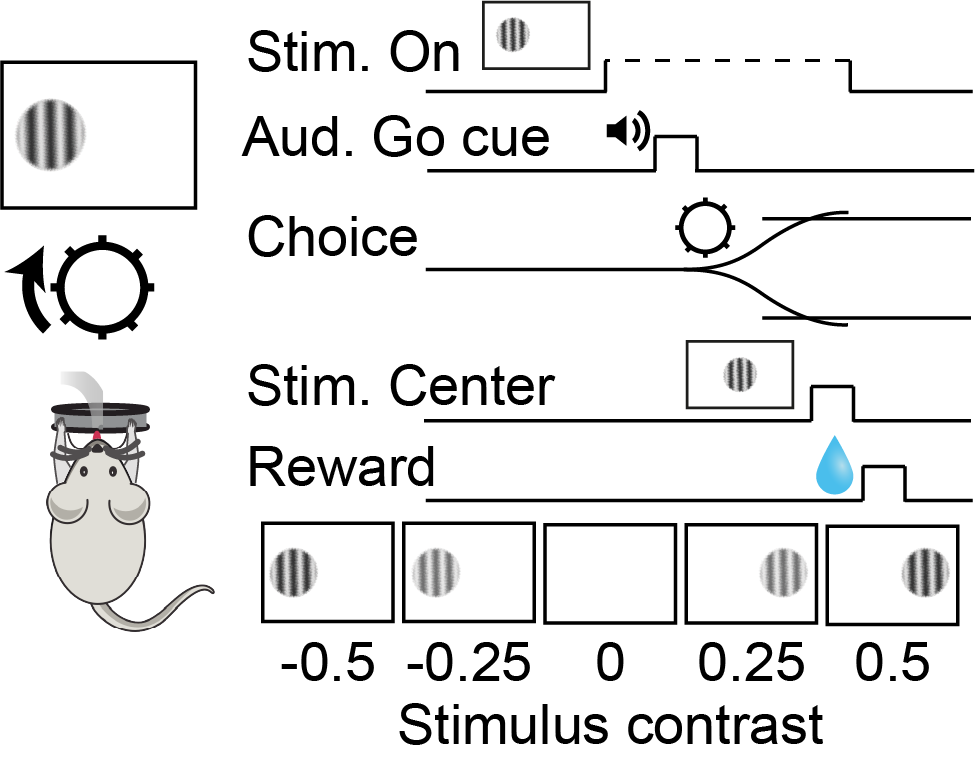
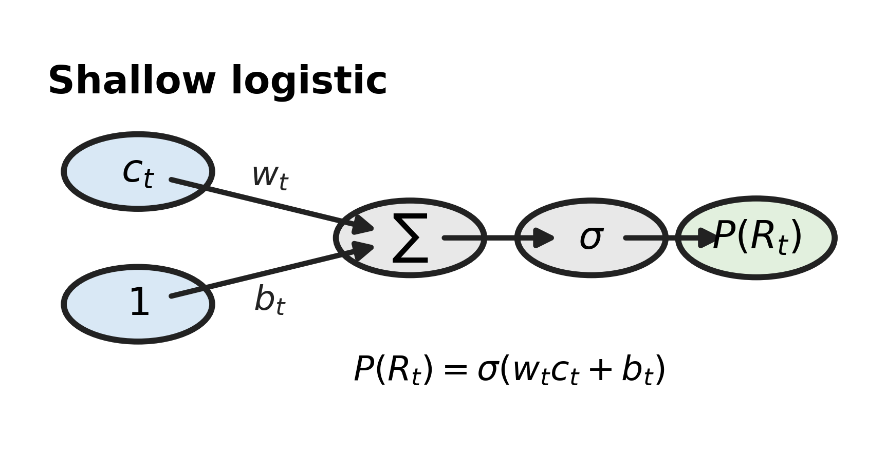
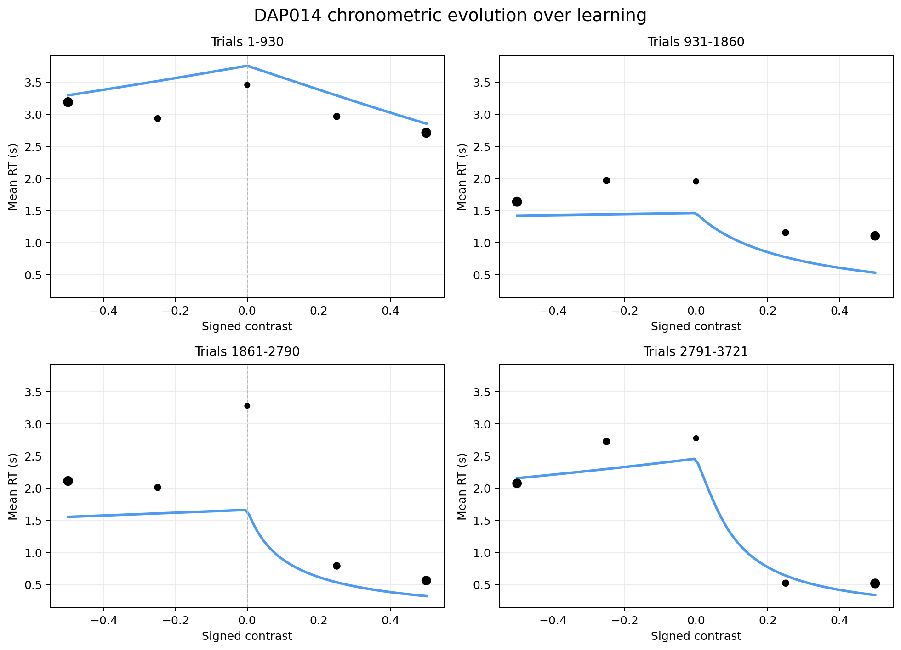
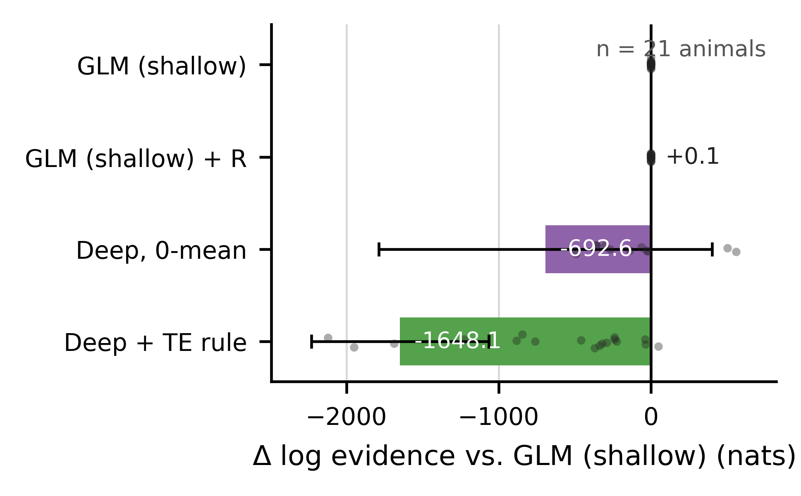
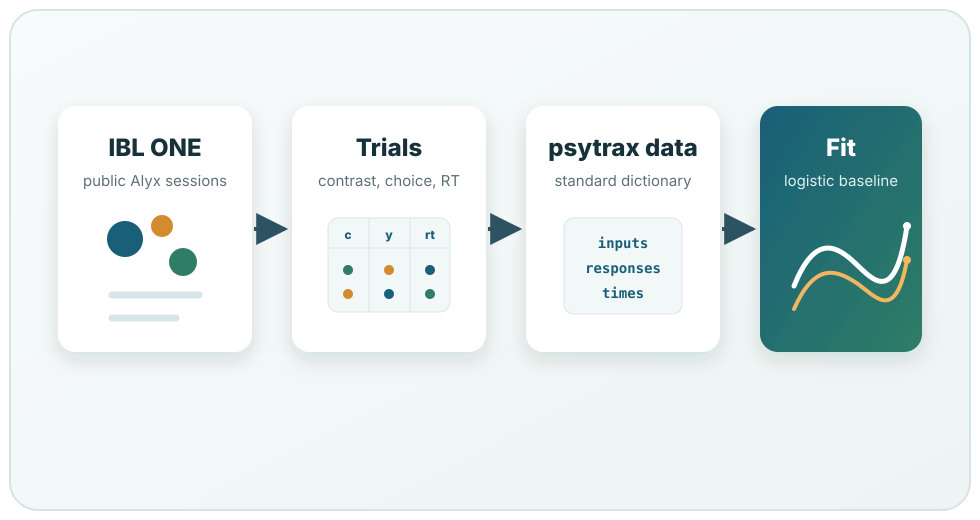

# Examples

Examples show complete scientific workflows. Start with a small choice-only fit
if you are checking your installation, then move to reaction-time models, model
recovery, and data-loading examples.

<div class="psytrax-example-gallery">
  <figure class="psytrax-example-wide">
    
    <figcaption><strong>Behavioural task.</strong> A long-term learning task with stimulus contrast, go cue, choice, stimulus centering, and reward events aligned within each trial.</figcaption>
  </figure>
  <figure>
    
    <figcaption><strong>Choice model.</strong> A simple logistic model is a useful first fit before moving to richer reaction-time models.</figcaption>
  </figure>
  <figure>
    
    <figcaption><strong>Parameter trajectories.</strong> A saved race-model fit showing trial-by-trial parameter estimates and uncertainty.</figcaption>
  </figure>
  <figure>
    
    <figcaption><strong>Psychometric evolution.</strong> Fitted choice predictions summarised across learning windows.</figcaption>
  </figure>
  <figure>
    
    <figcaption><strong>Chronometric evolution.</strong> Reaction-time predictions from the same race-model fit.</figcaption>
  </figure>
</div>

## Worked examples

<div class="psytrax-worked-examples">
  <article class="psytrax-worked-example">
    
    <div class="psytrax-worked-example-body">
      <h3>Recreate the documentation figures</h3>
      <p>Load the bundled DAP014 race-model fit and regenerate the trajectory, psychometric, and chronometric panels used throughout the docs.</p>
      <p><code>generate_dap014_docs_figures.py</code></p>
      <p class="psytrax-script-link"><a href="https://github.com/SamuelLiebana/psytrax/blob/main/examples/generate_dap014_docs_figures.py">View script</a></p>
    </div>
  </article>
  <article class="psytrax-worked-example">
    
    <div class="psytrax-worked-example-body">
      <h3>Compare built-in models</h3>
      <p>Fit logistic, diffusion, and race-model likelihoods to the same mouse and compare them with the approximate log evidence returned by psytrax.</p>
      <p><code>compare_models_DAP009.py</code></p>
      <p class="psytrax-script-link"><a href="https://github.com/SamuelLiebana/psytrax/blob/main/examples/compare_models_DAP009.py">View script</a></p>
    </div>
  </article>
  <article class="psytrax-worked-example">
    
    <div class="psytrax-worked-example-body">
      <h3>Load public IBL trials</h3>
      <p>Search subjects and sessions with ONE, handle common public IBL trial layouts, and convert the result to a psytrax data dictionary.</p>
      <p><code>ibl_one_integration_walkthrough.ipynb</code></p>
      <p class="psytrax-script-link"><a href="https://github.com/SamuelLiebana/psytrax/blob/main/examples/ibl_one_integration_walkthrough.ipynb">View notebook</a></p>
    </div>
  </article>
</div>

## Detailed examples

::::{grid} 1 1 2 2
:gutter: 3

:::{grid-item-card} Choice-only logistic fit
:link: logistic-first-fit
:link-type: doc
Fit a fast logistic baseline to contrast and choice data.
:::

:::{grid-item-card} Race model with reaction times
:link: race-model-rt
:link-type: doc
Fit a model that explains both choices and reaction times.
:::

:::{grid-item-card} Model recovery
:link: model-recovery
:link-type: doc
Simulate known trajectories and check whether psytrax can recover them.
:::

:::{grid-item-card} CSV workflow
:link: csv-workflow
:link-type: doc
Convert a trial table into the psytrax data dictionary.
:::
::::

```{toctree}
:maxdepth: 1
:hidden:

logistic-first-fit
race-model-rt
model-recovery
csv-workflow
```
