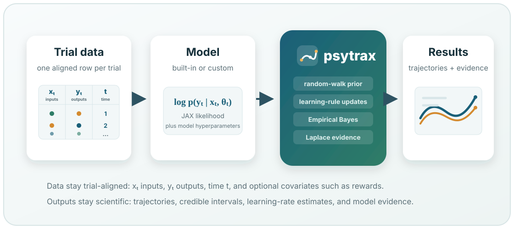

# psytrax

Empirical Bayes fitting for trial-by-trial decision models.

<div class="psytrax-hero">
  <div class="psytrax-hero-copy">
    <p class="psytrax-kicker">Behavioural modelling across trials</p>
    <h1>Fit interpretable decision-model trajectories from trial-by-trial data.</h1>
    <p class="psytrax-lede">
      psytrax helps researchers estimate how latent decision-making parameters
      change over learning, fatigue, task engagement, or experimental
      manipulations. You provide a per-trial likelihood; psytrax handles
      random-walk priors, MAP fitting, Laplace evidence, model comparison, and
      uncertainty over trajectories.
    </p>
    <div class="psytrax-actions">
      <a class="psytrax-button primary" href="tutorials/first-fit.html">Start a first fit</a>
      <a class="psytrax-button" href="user-guide/index.html">User guide</a>
      <a class="psytrax-button" href="examples/index.html">Examples</a>
      <a class="psytrax-button" href="community/support.html">Connect</a>
    </div>
  </div>
  <div class="psytrax-hero-figure">
    
  </div>
</div>

## Overview

psytrax is designed for experiments where behaviour is organised one trial at a
time: choices, reaction times, stimuli, rewards, sessions, and other
trial-aligned signals. The package fits a Gaussian random-walk prior over model
parameters, so the output is a trajectory for each parameter rather than a
single static estimate.

Use psytrax when you want to:

- recover trial-by-trial changes in decision weights, biases, thresholds, or
  model-specific parameters;
- compare candidate behavioural models with approximate marginal likelihood;
- add learning rules or model-level hyperparameters without rewriting the
  inference engine;
- start from built-in logistic, DDM, race, or MLP models, then move to your own
  JAX-compatible per-trial likelihood.

<div class="psytrax-feature-row">
  <a class="psytrax-feature" href="user-guide/data-format.html">
    <strong>Prepare data</strong>
    <span>Convert trial tables into the small dictionary format psytrax expects.</span>
  </a>
  <a class="psytrax-feature" href="user-guide/models.html">
    <strong>Choose models</strong>
    <span>Use built-in models or write a custom likelihood for your task.</span>
  </a>
  <a class="psytrax-feature" href="api/index.html">
    <strong>Reference API</strong>
    <span>Look up public functions, model modules, and learning-rule helpers.</span>
  </a>
</div>

```{toctree}
:hidden:
:maxdepth: 2
:caption: Documentation

tutorials/index
user-guide/index
examples/index
api/index
community/index
maintenance
publication
```
